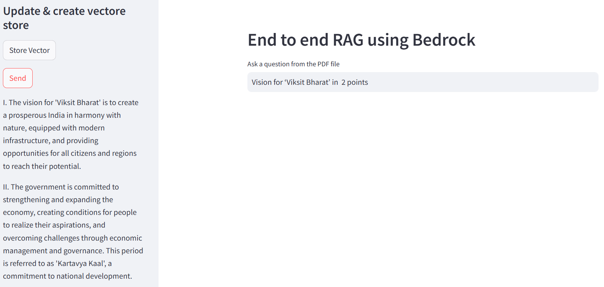

# End-to-End-RAG-Using-Amazon-Bedrock


## How to run?

###  1.Create a new environment

```bash
conda create -n llmapp python=3.8 -y 
```


###  2.Activate the environment
```bash
conda activate llmapp 
```


###  3.Install the requirements package
```bash
pip install -r requirements.txt
```


###  4. run your application
```bash
streamlit run main.py
```

### 1. Login with your AWS console and launch an EC2 instance
### 2. Run the following commands
```bash
sudo apt update
```
```bash
sudo apt-get update
```
```bash
sudo apt upgrade -y
```
```bash
sudo apt install git curl unzip tar make sudo vim wget -y
```
```bash
git clone Your-repository
```
```bash
sudo apt install python3-pip
```
```bash
pip3 install -r requirements.txt
```
```bash
#Temporary running
python3 -m streamlit run main.py
```
```bash
#Permanent running
nohup python3 -m streamlit run main.py
``` 


